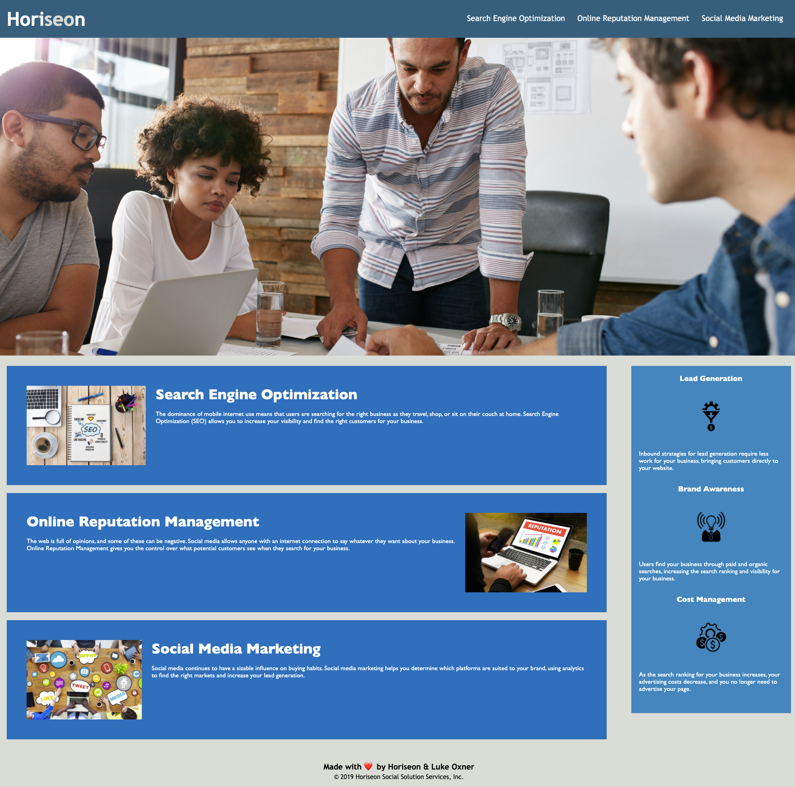

# marketingCompanyRefactor

## Description

This is my first homework submission for the University of Denver Coding Bootcamp! For this activity, I was instructed to refactor the HTML and CSS of a marketing company's website. The goal was to make the codebase to follow accessibility standards so that the site would be optimized for search engines. I accomplished this by converting div tags to semantic tags, adding accessible alt attributes for images, and ensuring the organization of the code followed a logical structure. In addition, I edited the CSS file to be more concise, eliminating redundant classes and applying styling to parent classes when possible. I also added comments throughout the CSS file explaining my changes, as well as their intended results. 

## Deployment

The code (and associated assets) are hosted right here in this GitHub repository, and it's all live on the web thanks to GitHub pages. If you would like to check it out, you can view the site at the link below:

<a href="https://lukeoxner.github.io/marketingCompanyRefactor" target="_blank"><b>marketingCompanyRefactor Live Website</b></a>
  

 ## Credits
 
 This project was made largely using "starter code" provided by the bootcamp. I took that started code and refactored it as discussed in more detail in the **Description** section above.
